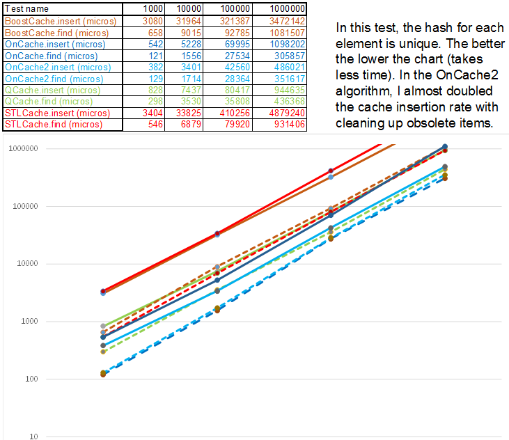
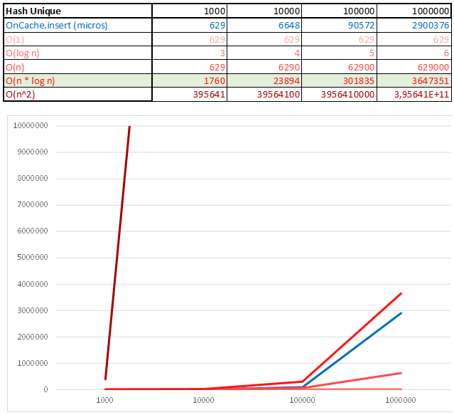
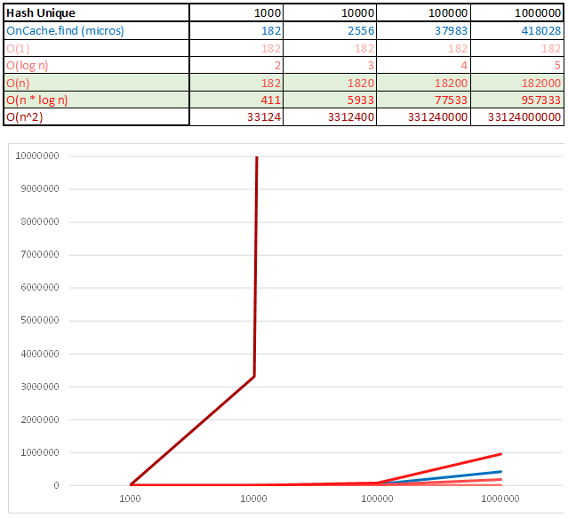
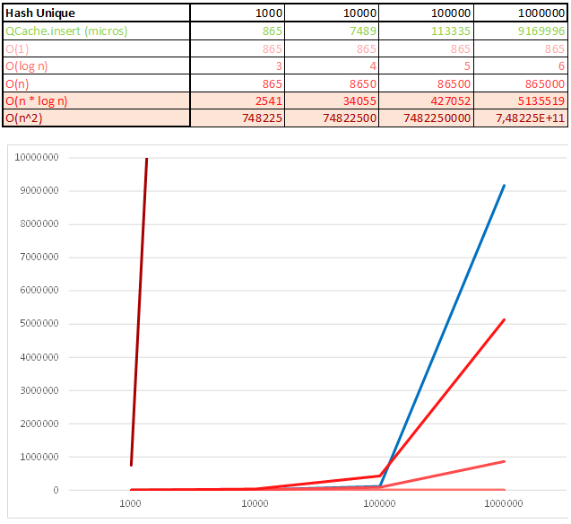
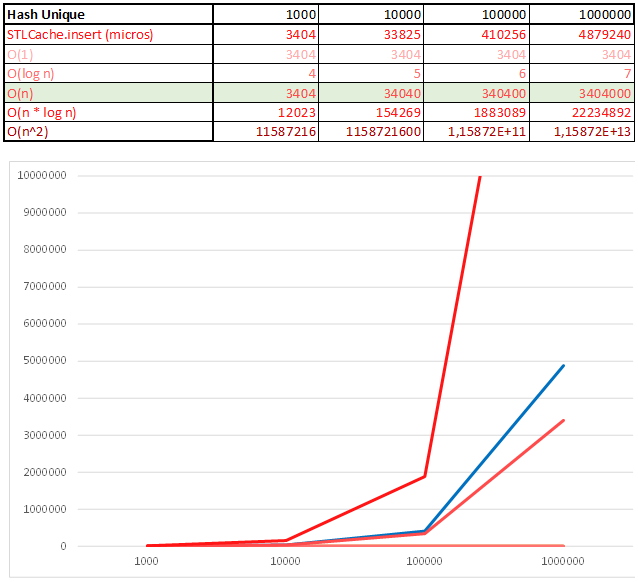

# Single-threaded caches
## Comparative testing of single-threaded caches for the SpecNet project

The program creates a set of random data, then for various containers / collections measures the time of insertion and search of this data. The amount of data for the test starts from the initial size and then starts with a step of * 10: 100, 1000, 10000 .. The test results are saved to the file aka "cache.compare.1545103089.csv" next to the executable file "cacheCompare". It is possible to repeat the test with the last set of data for debugging.
At the moment, comparative testing of 3 algorithms is being performed:
1. QCache = Hash Table ( Qt implementation )
2. STL cache = Red-black Tree ( [from here](https://jaeyu.wordpress.com/2014/04/15/lru-cache-in-c/) )
3. Boost Cache = boost::intrusive::unordered_set ( [from Facebook](https://github.com/facebook/folly/blob/master/folly/container/EvictingCacheMap.h) )
4. OnCache = my implementation of the Hash Table + Skip List (reduced dependence on hash uniqueness)
5. OnCache2 = my better implementation of the Hash Table + Skip List (twice reduced dependence on hash uniqueness). It is ARC-like (Adaptive Replacement Cache) algorithm:elements that are more often used have the opportunity to survive the destruction by the old age and continue to exist while they are used.

By reducing the dependence on the uniqueness of the hash, you can simplify the hash function — for example, count not by the entire cached text, but by the first 10 characters. For example, if 1 kilobyte is cached, then the savings on the hash function can be 100 times == instead of 100 servers, only 1 will suffice.

How to build:
It is enough to open the project file "cacheCompare.pro" in Qt and run it.
In the "main.cpp" you can change settings:

```c++
#define TEST_MAXSIZE 1000000
#define START_LOGPOINT 1000
#define TEST_CASE_FILE
#define LOAD_DATA_FROM_TEST_CASE_FILE false
#define MAKE_HASH_NOT_UNIQUE false
```

## Test results
The lower the graph, the less time spent on processing the current volume of data:


As expected Red-black Tree algorithm begins to win when data appears with a non-unique hash:


## Now let's analyze the time complexity  O(n) of the algorithms.
### When the hash is not unique:

#### It's fun that the results are terrible in terms of performance, but they may look good in terms of the time complexity of the algorithm:










### When the hash is unique:





---

The OnCache algorithm was written by me for the SpecNet project to achieve maximum server speed as it is assumed that people who will organize communication will not have the resources to run the farm from hundreds of servers - in the best case there will be one server, or only equipment like a Wi-Fi router and this equipment should handle the load.
The source code for the SpecNet project can be found in the repository:

[https://github.com/DimaBond174/SpecNet](https://github.com/DimaBond174/SpecNet)

---
  Copyright (c) Dmitriy Bondarenko
  feel free to contact me: specnet.messenger@gmail.com


